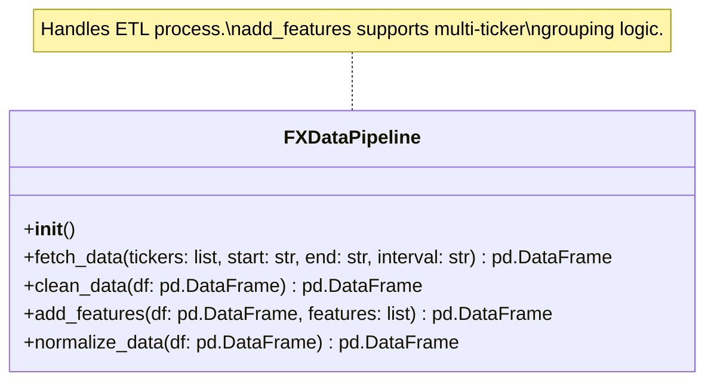
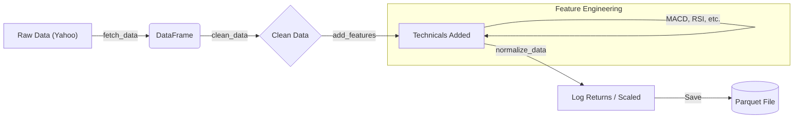
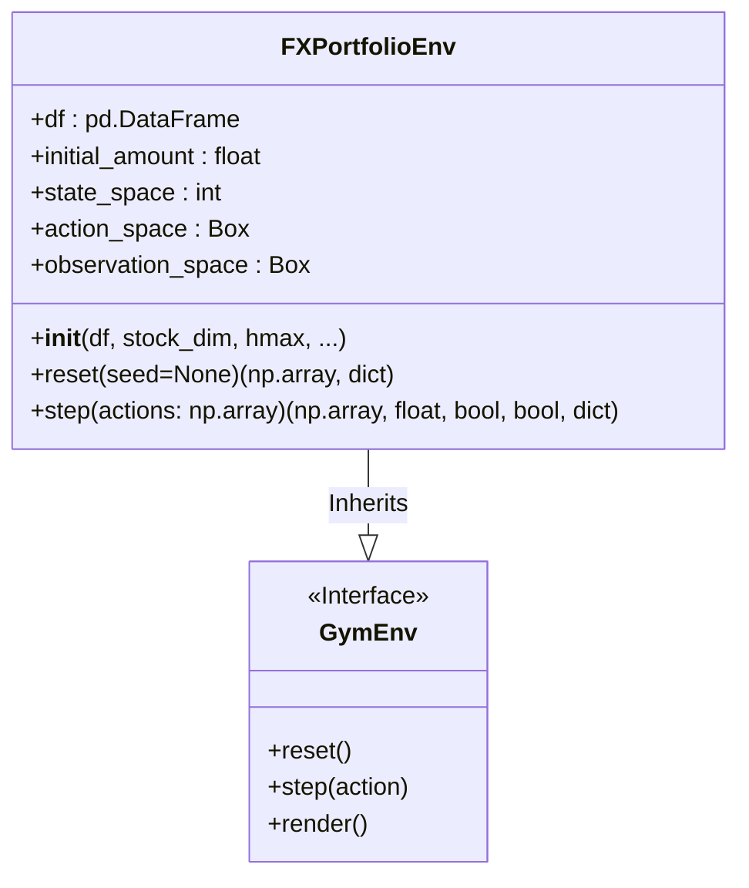
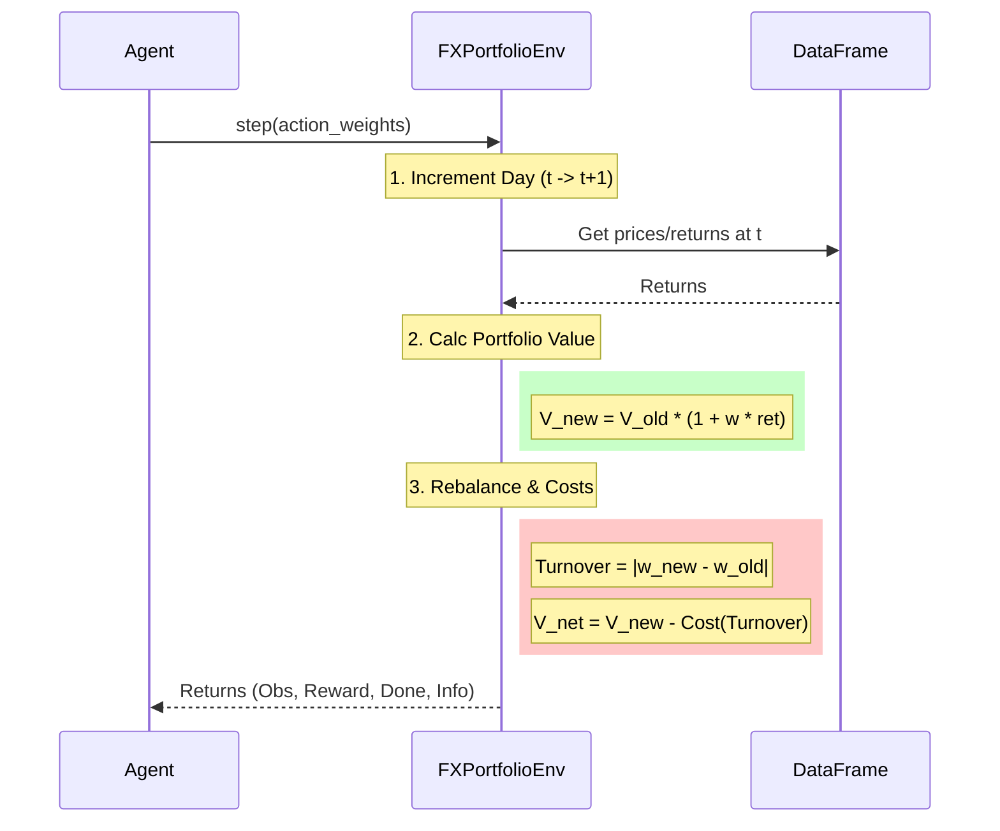

# System Architecture: DataOps & Environment

This document details the current architecture of the **DataOps Pipeline** and **FX Portfolio Environment** for the Alpha-FX project.

## 1. DataOps Module
The `dataops` module handles the extraction, transformation, and loading (ETL) of financial data.

### 1.1 FXDataPipeline Class
The core component is the `FXDataPipeline`, designed to be modular and testable.

### 1.2 Data Processing Flow
The data flows through four distinct stages:

## 2. Environment Module
The `finrl.meta.env_fx_trading` module contains the Gymnasium-compliant trading environment.

### 2.1 FXPortfolioEnv Class
The environment simulates portfolio management with transaction costs and rebalancing logic.

### 2.2 Step Logic & State Transition
The `step()` method implements the core financial logic for state transitions.

## 3. Data Structures
### Observation Space
Currently defined as a Box of shape `(state_space,)`.
*Future Refinement*: `(n_tickers, window_size, features)`

### Action Space
Defined as a Box of shape `(n_tickers,)` representing portfolio weights.
*Constraint*: Weights should sum to <= 1.0 (remainder is cash).
