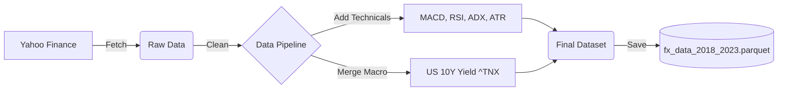

# FinRL Alpha-FX Usage Guide

This guide provides a step-by-step tutorial on how to use the Alpha-FX system, designed for both developers and financial analysts.

## FX Trading: A Primer for Non-Experts
If you are new to Forex (Foreign Exchange) trading, here are the key concepts used in this project:

### 1. Understanding the Tickers (Financial Context)
The agent trades a portfolio of 5 currency pairs. It is critical to understand "Who is pricing Whom" (Base vs. Quote) to interpret the agent's actions suitable for the US Dollar.

**A. The "Anti-USD" Majors (Direct Quote)**
*   **`EURUSD=X` (Euro / USD)** and **`GBPUSD=X` (British Pound / USD)**
*   **Meaning**: How many USD you get for 1 EUR/GBP.
*   **Correlation**: If these go **UP**, the USD is **WEAKENING**. Buying these means "Shorting USD".

**B. The "USD-Base" Majors (Indirect Quote)**
*   **`JPY=X` (USD / Japanese Yen)** and **`SEK=X` (USD / Swedish Krona)**
*   **Meaning**: How many Yen/Kronor you get for 1 USD.
*   **Correlation**: If these go **UP**, the USD is **STRENGTHENING**. Selling these means "Shorting USD".
*   *Note*: Yahoo Finance denotes these with `=X` suffix. `JPY=X` is USDJPY, `SEK=X` is USDSEK.

**C. The Cross-Rate**
*   **`EURSEK=X` (Euro / Swedish Krona)**
*   **Relationship**: $EURSEK \approx EURUSD \times USDSEK$.
*   **Role**: Provides arbitrage signals. If the market price drifts from the synthetic price derived from the USD pairs, the agent can exploit the inefficiency.

---

### 2. Actions (Weights)
In our Reinforcement Learning environment, the agent outputs **Portfolio Weights** for each currency.
*   `[0.5, 0.5]` means 50% of value in EUR, 50% in USD.
*   **Buying/Selling**: Changing weights (e.g., from `[0, 1]` to `[1, 0]`) implies selling USD to buy EUR.

### 3. The "Carry Trade" (Interest Rates)
A major driver in FX is the **Interest Rate Differential**.
*   Money flows to currencies with higher interest rates (to zero-risk yield).
*   **Alpha-FX Feature**: We feed the agent the **US 10-Year Treasury Yield (`^TNX`)** so it can learn to "follow the yield."

### 4. Technical Indicators
*   **Trends**: Is the price going up or down? (MACD, ADX).
*   **Volatility**: How "bouncy" is the price? (ATR, Bollinger Bands).
*   **Momentum**: Is the move overextended? (RSI, Williams %R).

---

## 1. Setup

Ensure you have Python 3.10+ installed.

```bash
# Clone the repository
git clone <your-repo-url>
cd FinRL

# Create and activate a virtual environment
python -m venv .venv
source .venv/bin/activate  # On Windows: .venv\Scripts\activate

# Install dependencies
pip install -r requirements.txt
pip install -e .

# If you are running the jupyter notebook you need ipykernel
pip install ipykernel

# Add the virtual environment to the jupyter kernel
python -m ipykernel install --user --name .venv --display-name "Python (FinRL venv)"
```

### Quick Start (3-Step Workflow)
Once setup is complete, the standard workflow is:
1.  **Data Generation**: `python planning/run_pipeline.py --tickers "EURUSD=X" --start "2018-01-01"`
2.  **Training**: `python train_agent.py --timesteps 50000 --lookback 30`
3.  **Benchmarking**: `python benchmark_agent.py --lookback 30`

### Interactive Demo (Recommended)
For a visual and interactive experience, open the included Jupyter Notebook:
```bash
jupyter notebook alpha_fx_demo.ipynb
```
This notebook walks you through the entire pipeline with charts and explanations.

### Starting Fresh (Clean Slate)
To remove all generated data and models and start from scratch:
```bash
python clean.py
```
This deletes the `data/` and `models/` directories.

## 2. Data Preparation (DataOps)

Before training, you need to download and process the FX data. The pipeline fetches data from Yahoo Finance, cleans it, adds technical indicators, and saves it as a Parquet file.



**Features Generated:**
*   **[MACD](https://www.investopedia.com/terms/m/macd.asp) (Moving Average Convergence Divergence)**:
    *   *Settings*: Fast=12, Slow=26, Signal=9 (Standard).
    *   *Relevance*: Identifies momentum changes. A crossover suggests a potential trend reversal, crucial for intraday FX trends.
*   **[RSI](https://www.investopedia.com/terms/r/rsi.asp) (Relative Strength Index)**:
    *   *Window*: 30 days.
    *   *Relevance*: Measures overbought/oversold conditions. In oscillating FX pairs, this helps identify reversal points.
*   **[CCI](https://www.investopedia.com/terms/c/commoditychannelindex.asp) (Commodity Channel Index)**:
    *   *Window*: 30 days.
    *   *Relevance*: Identifies cyclical trends. Useful for currency pairs that often trade in ranges.
*   **[DX](https://www.investopedia.com/terms/d/dmi.asp) (Directional Movement Index)**:
    *   *Window*: 30 days.
    *   *Relevance*: Quantifies trend strength (regardless of direction). Helps the agent decide whether to follow a trend or mean-revert.
*   **[Bollinger Bands](https://www.investopedia.com/terms/b/bollingerbands.asp)**: Upper (`boll_ub`) and Lower (`boll_lb`) bands.
    *   *Relevance*: a measure of volatility. Prices touching the bands often indicate a breakout or reversion.

**Using the CLI:**

```bash
python planning/run_pipeline.py --tickers "EURUSD=X,GBPUSD=X" --start "2018-01-01" --end "2023-01-01"
```

*   `--tickers`: Comma-separated list of Yahoo Finance tickers.
*   `--start`, `--end`: Date range for historical data.
*   **Output**: Creates `data/fx_data_2018_2023.parquet`.

## 3. Training the Agent

Once the data is ready, you can train the Deep Reinforcement Learning agent.

**Algorithm: PPO (Proximal Policy Optimization)**
We use **PPO**, a popular on-policy gradient method.
*   **Why PPO?** It strikes a balance between ease of implementation, sample efficiency, and ease of tuning.
*   **Comparison**: Unlike **A2C** (which can be unstable) or **TRPO** (which is computationally expensive), PPO uses a "clipped surrogate objective" to ensure stable policy updates, preventing the agent from making drastic, destructive changes to its strategy in a single step.
*   **Relevance for FX**: Financial markets are noisy and non-stationary. PPO's stability makes it robust against market noise, preventing overfitting to short-term anomalies.

*   *Reference*: [OpenAI Spinning Up: PPO](https://spinningup.openai.com/en/latest/algorithms/ppo.html)
*   *Deep Dive*: [Proximal Policy Optimization Algorithms (Schulman et al., 2017)](https://arxiv.org/abs/1707.06347)

**Run the training script:**

```bash
python train_agent.py --timesteps 50000 --lookback 30 --ent-coef 0.01
```

*   **Process**:
    *   Loads `data/fx_data_2018_2023.parquet`.
    *   Initializes the `FXPortfolioEnv` with transaction costs (0.1%).
    *   Trains a PPO agent for the specified timesteps.
    *   Saves the trained model to `models/fx_agent_tuned.zip`.
    *   **Logs**: Saves training progress to `results/monitor.csv` (for Plotting).

**Customizable Parameters:**
The script now supports several arguments to fine-tune performance:

*   `--timesteps` (Default: 30000): Duration of training. Increase for better learning.
*   `--lookback` (Default: 10): Window size for history. **Important**: Must match what is used in Benchmarking. Increasing to 30 or 60 helps capture longer trends.
*   `--ent-coef` (Default: 0.00015): Entropy Coefficient. Controls exploration. Increase to 0.001 or 0.01 to encourage the agent to try new strategies.
*   `--lr` (Default: 2.27e-5): Learning Rate.

**Interpreting Training Output:**
When the script runs, it logs metrics to the console. Key metrics to watch:
*   `ep_rew_mean` (Episode Reward Mean): The average reward per episode. This should **increase** over time, indicating the agent is learning a profitable strategy.
*   `fps` (Frames Per Second): Speed of training.
*   `explained_variance`: How well the Value Function predicts returns. Values close to **1.0** are ideal. Low or negative values indicate the value function is struggling.
*   `loss`: The PPO loss. This may fluctuate but shouldn't explode.

*Tip: If `ep_rew_mean` is flat or negative, try adjusting hyperparameters (higher ent_coef) or checking if your data contains valid signals.*

## 4. Evaluation & Backtesting

After training, evaluate the agent's performance on unseen data (or the 2022 subset).

**Run the backtest script:**

```bash
python backtest_agent.py
```

*   **Process**:
    *   Loads the saved model from `models/fx_agent_tuned.zip`.
    *   Runs the agent on data from 2022-01-01 onwards.
    *   Calculates performance metrics (Sharpe Ratio, Final Portfolio Value).

**Interpreting Backtest Results:**
The script prints the Final Portfolio Value and Sharpe Ratio.
*   **Final Portfolio Value**: Compare this to your `initial_amount` (e.g., 1,000,000). A value > Initial indicates profit.
*   **Sharpe Ratio**: A measure of risk-adjusted return.
    *   `> 1.0`: Good.
    *   `> 2.0`: Excellent.
    *   `< 0`: The strategy is losing money or taking excessive risk for the return.
*   **Sanity Check**: If the agent makes huge profits in training but loses in backtesting, it is likely **overfitting**. Try reducing model complexity or adding regularization.
## 5. Hyperparameter Tuning
To improve agent performance beyond the MVP baseline, use the tuning script which leverages **Optuna** to find optimal hyperparameters.

```bash
python tune_agent.py
```

*   **Process**: Runs multiple trials (defined in script) to maximize the Sharpe Ratio/Reward.
*   **Output**: Prints the best parameters found (e.g., Learning Rate, Batch Size).
*   **Action**: Manually update `train_agent.py` with these new parameters and retrain.

## 6. Optimization & Benchmarking
Compare your trained agent against standard baselines.

```bash
python benchmark_agent.py --lookback 30
```

*   **Process**:
    *   Loads `models/fx_agent_tuned.zip`.
    *   Runs the validation loop on unseen data.
    *   **Results**: Saves equity curve to `results/equity.csv`.

*   **Arguments**:
    *   `--lookback`: **CRITICAL**. Must match the lookback used during training (e.g., 30). If mismatched, you will see a dimension error.

*   **Interpretation**:
    *   **Positive Alpha**: Agent Return > Baseline Return.
    *   **Sharpe Improvement**: Agent Sharpe > Baseline Sharpe.

## 7. Troubleshooting
*   **yfinance import error (`websockets.sync`)**: If the data pipeline fails with a `websockets` import error, upgrade your websockets package: `pip install --upgrade websockets`. Alternatively, if `data/fx_data_2021_2022.parquet` already exists, you can skip the data preparation step.
*   **KeyError: 'date'**: Ensure your parquet file index is reset. The `FXDataPipeline` handles this, but if loading custom data, ensure `date` is a column.
*   **ModuleNotFoundError**: Run `pip install -e .` again to ensure the package is linked.
*   **NaN Rewards**: Check if your data contains NaNs. The pipeline's `clean_data` should handle this, but verify `df.isna().sum()`.

## 8. Development Workflow

For developers contributing to the project, please refer to:
*   [Development Workflow](development_workflow.md): TDD guidelines and CI/CD details.
*   [System Architecture](system_architecture.md): Detailed UML diagrams of the system.
